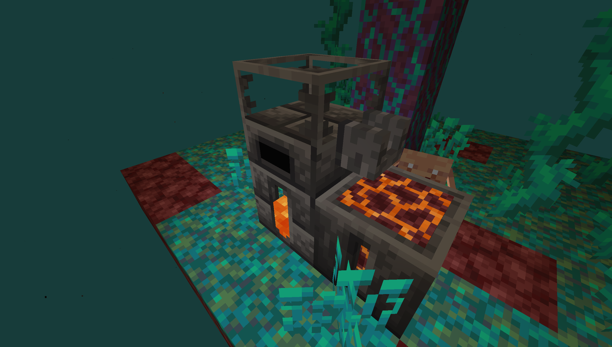

# Welcome to Hell!
1. Start by making a gold farm. Zombified Piglins only spawn on magma blocks. It doesn't have to be very efficient, you will get better tools to make it more efficent as you go.
2. Set up auto piglin bartering.
3. Craft a Seared Melter, Seared Tank, Seared Faucet, and Casting Basin, place as seen below:

4. Melt weeping and twisting vines to get molten copper and molten zinc respectively. Melt blackstone and cast it onto blackstone for andesite.
5. Your way to the Create mod is now open, the underworld is your oyster, etc!
6. ???
7. Profit!
8. ???
9. Make a portal with obsidian.
10. Leave the Nether.
11. Profit more? idk, the overworld is your oyster now I guess.

## Piglin bartering can get you:
- gold leaf, Amount: 1-2. Used for Nature's Aura rituals and recipes.
- awkward potion, Amount: 1.
- black lotus, Amount: 1. Concentrated mana from Botania. Throw it in a non-empty mana pool to use it.
- turtle egg, Amount: 1. Useful for making your gold farm more efficient. Also used in various spawn egg recipes.
- soul sand, Amount: 6-12.
- gravel, Amount: 8-16.
- blackstone, Amount: 8-16.
- quartz, Amount: 5-12.
- iron nugget, Amount: 27-45.
This info has been added in JEI as well. See uses of gold ingot, or how to make any of the above items.

## Mobs will only spawn on certain blocks:
- zombified_piglins: magma blocks
- piglins: netherrack
- endermen: soul sand/soul soil
- blaze: quartz blocks
- wither skeletons: nether bricks
- ghast: gravel
- magma cube: crimson hyphae
- hoglins: crimson nylium
- Nothing spawns on warped nylium (or any other blocks that I also haven't mentioned)
- Zombified piglins can spawn 5-100 blocks away from you, the player. All other mobs can spawn 20-100 blocks away from you, the player.
- May adjust these spawn rules more later. Mods shouldn't drop any non-stackable items (swords, armor, etc), if they do, notify me and I'll fix it so they don't.
- Item drop rates have generally been increased

Warped/ Crimson Nylium has been modified to basically act as grass/dirt except it can't be tilled. So you can plant saplings and Botania flowers on Nylium.
Bone meal on nylium still only gets you the fungi, roots, and etc.

## Very useful, but not required
- construction wand
- tape measure
- storage drawers + drawer controller, for mass storage
  - storage drawers can be crafted with warped/crimson wood, warped wood -> dark oak drawers, crimson wood -> acacia drawers
- waystones let you warp between different parts of your base
- combustive fishing rod, fishing rod used on lava, check its uses to see what you can fish up
- using Tinker's tools is optional, but encouraged.
- edit config/jei/blacklist.cfg to blacklist any items you don't like clogging your jei

##### Every Botania flower aside from pure daisy (which is required)
- loonium can get you loot from the vanilla dungeon chest loot table (heavy mana investment)
- orechid can get you overworld ores (heavy mana investment)
- orechid ignem is the nether equivalent of the orechid (can spawn netherite ore).
- vinculotus stops endermen from teleporting, useful for endermen farms
- hopperhock is a filterable vaccuum block
- etc.
- Read your Lexica Botania for more.

##### Create mod extras
- redstone link is wireless redstone :o
- schematicannon, build/plan something out in creative, save it as a schematic, and have the schematicannon automatically build it for you in survival!
- in general just Ponder anything that sounds interesting :D

#### Tips for n00bs who are stuck -spoilers-
- JEI is your best friend! Many custom notes and hints have been added to the JEI info tab for specific items.
- Check the uses for things like Pure Daisy, Pressure Chamber, Gold Powder (Ritual of the Forest) and Mixer, many custom recipes have been added for these
- The petal apothecary is useless since you don't have water, other methods of flower crafting have been added
- Water wheel can spin with lava, and it won't get burned up
- Your first pieces of redstone should come from spawning witches with witch eggs, which you *can* craft, see uses of turtle eggs for more spawn eggs you craft.
- Pure daisy-ing a shroomlight = a glowstone block
- Pure daisy-ing a charcoal block = a dried kelp block
- Pure daisy-ing a white petal block = white wool, which can then be turned into string
- Hopper recipe uses gold ingots instead of iron now!
- Pressure chamber a blue petal block = lapis block
- Use Tinker's Construct to make a silk touch tool (you need 5 silk around a tool in a tinker station/forge)
  - allows you to get some nylium wherever you want, for planting botania flowers and etc
- Melting a blaze in a smeltery gets you molten blaze, a better fuel for your smeltery
- Melting a wither skeleton in a smeltery gets you a whole bucket's worth of milk
- Cocoon of caprice can get you mobs you otherwise could not spawn, like villagers
- Striders can still spawn in lava and they drop string

PS. Don't eat the fish. If you eat the fish anyway, I told you so! :p